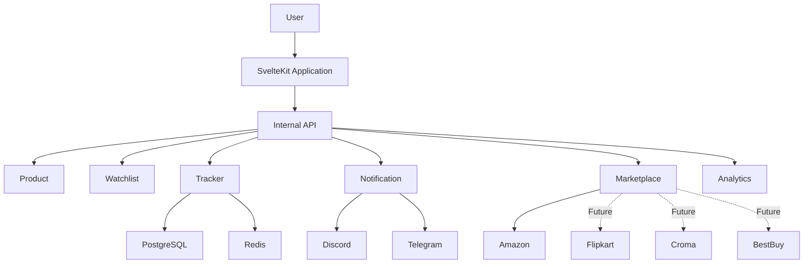
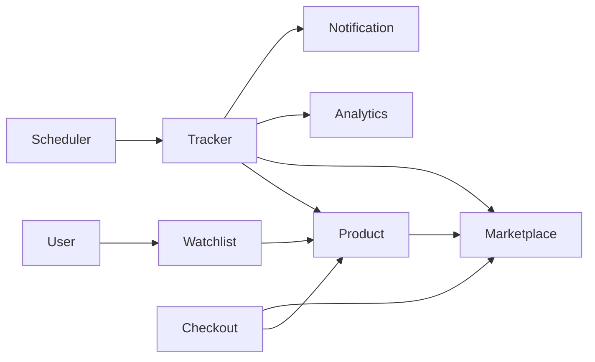
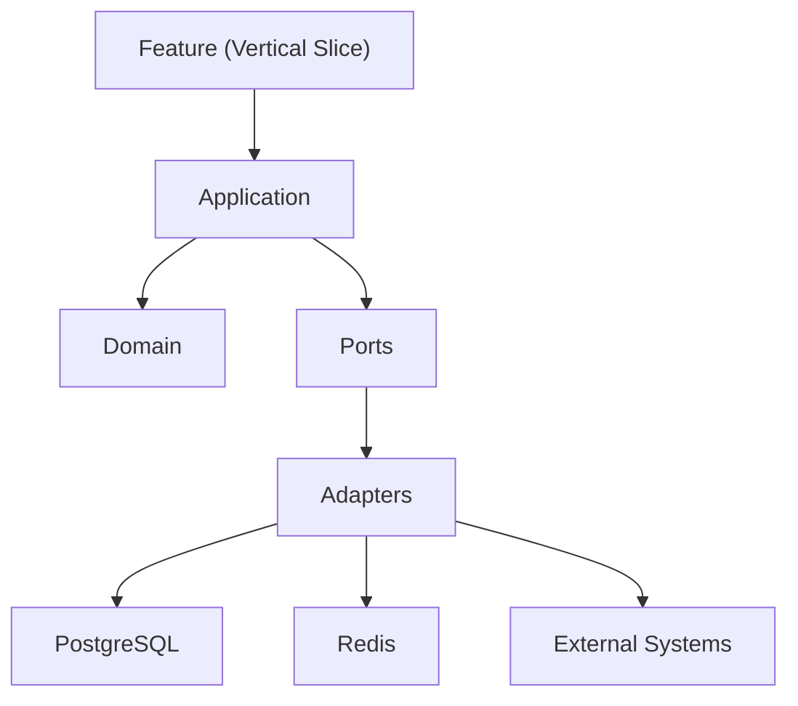
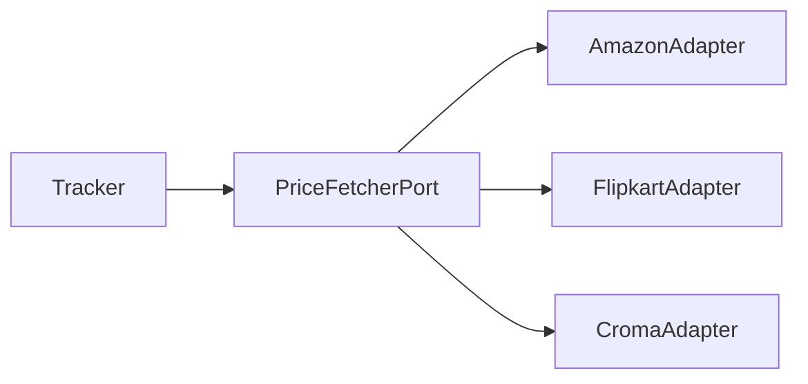
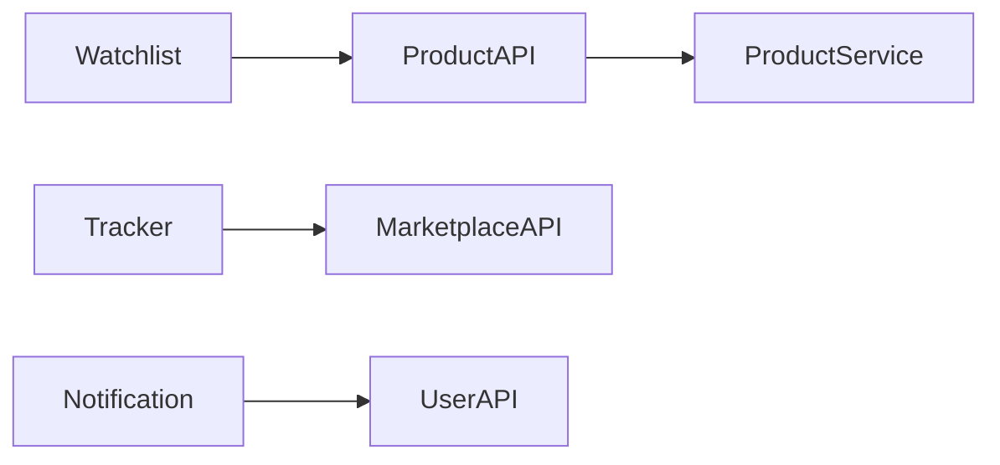
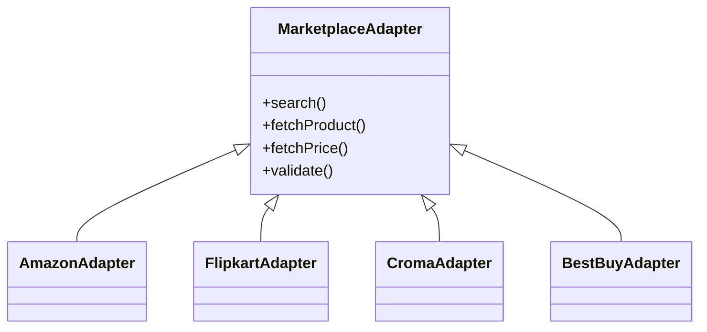
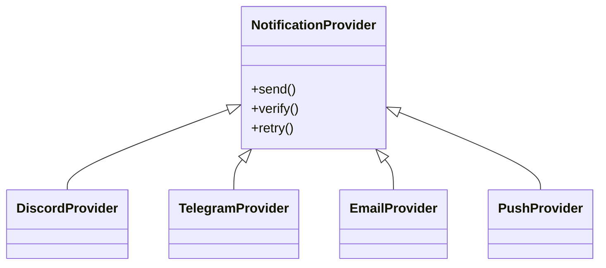
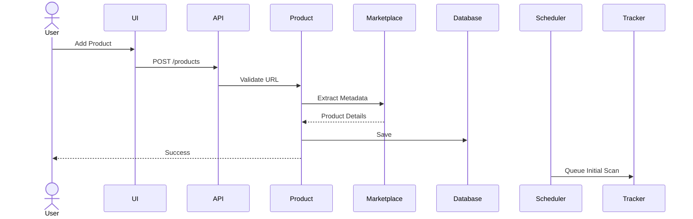
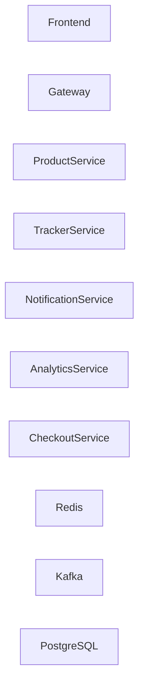

# Architecture

> This document describes the high-level architecture of **Prizen**, its modular boundaries, communication patterns, scalability strategy, and future evolution.

---

# Purpose

Prizen is designed as a **Modular Monolith (Modulith)**.

The primary objective is to maximize development velocity while ensuring each domain module can be extracted into an independent service with minimal refactoring when scaling demands it.

This document serves as the architectural blueprint for the project.

---

# Architectural Philosophy

Prizen combines multiple architectural patterns to balance simplicity, maintainability, and future scalability.

Rather than relying on a single architecture, the system adopts a layered approach where each pattern solves a specific problem.

- Modular Monolith provides deployment simplicity.
- Vertical Slice Architecture organizes features.
- Domain-Driven Design models business domains.
- Hexagonal Architecture isolates infrastructure.
- Event-Driven Design decouples modules.
- API-First Design enables future service extraction.

Each architectural pattern complements the others rather than replacing them.
---

# Goals

- Permanent self-hosting and user-owned persistence
- No required Prizen cloud service or remote control plane
- Clean separation of business domains
- Independent modules
- API-first architecture
- Infrastructure abstraction
- Event-driven internal communication
- Future microservice compatibility
- High maintainability
- Testability

---

# Non Goals

The architecture intentionally does **not** optimize for:

- Distributed systems on day one
- Service meshes
- Multiple databases
- Premature horizontal scaling
- Complex orchestration
- Multi-tenant SaaS hosting
- Cloud account synchronization
- Mandatory external telemetry

These concerns should only be introduced when justified by actual scaling requirements.

---

# Architectural Style

Prizen follows a **Modular Monolith** architecture.

Each business capability exists as an isolated module with clearly defined interfaces.

Modules communicate through internal contracts rather than directly accessing each other's implementation details.

```
┌─────────────────────────────┐
│         SvelteKit UI        │
└──────────────┬──────────────┘
               │
        Internal HTTP API
               │
┌────────────────────────────────────────────┐
│              Prizen Modulith               │
│                                            │
│  Product                                  │
│  Marketplace                              │
│  Watchlist                                │
│  Price Tracker                            │
│  Notification                             │
│  Scheduler                                │
│  Analytics                                │
│  User                                     │
│  Checkout (Future)                        │
└────────────────────────────────────────────┘
         │                     │
 PostgreSQL                Redis
```

---

# High-Level System Context



---

# Technology Stack

| Layer         | Technology         |
| ------------- | ------------------ |
| Frontend      | SvelteKit          |
| Language      | TypeScript         |
| ORM           | Drizzle ORM        |
| Database      | PostgreSQL         |
| Cache         | Redis              |
| Styling       | Tailwind CSS       |
| Components    | shadcn-svelte      |
| Deployment    | Docker             |
| Documentation | Markdown + Mermaid |
| API           | REST (OpenAPI 3.1) |

---

# Core Modules



Each module owns its own:

- API
- Services
- Repository
- DTOs
- Validation
- Events
- Tests

No module may directly manipulate another module's database entities.

---

# Internal Module Architecture

While Prizen is organized as a **Modular Monolith**, each module follows a combination of **Vertical Slice Architecture**, **Domain-Driven Design (DDD)**, and **Hexagonal Architecture (Ports & Adapters)**.

Each architectural pattern serves a specific purpose:

| Pattern                | Responsibility            |
| ---------------------- | ------------------------- |
| Modular Monolith       | Defines module boundaries |
| Vertical Slice         | Organizes features        |
| Domain-Driven Design   | Models business rules     |
| Hexagonal Architecture | Isolates infrastructure   |

---

## Module Structure



---

## Vertical Slice Architecture

Each feature is implemented independently.

Instead of large centralized services such as `ProductService` or `TrackerService`, every feature owns its complete request lifecycle.

Example:

```
track-product/

endpoint.ts

schema.ts

handler.ts

mapper.ts

tests.ts
```

This improves maintainability and prevents "God Services" from emerging as the application grows.

---

## Domain Layer

The Domain layer contains the core business rules of Prizen.

It includes:

- Entities
- Value Objects
- Domain Services
- Domain Events
- Business Policies

The Domain layer must never depend on infrastructure concerns.

---

## Ports & Adapters

Infrastructure is accessed only through ports (interfaces).

For example, the Tracker module depends on a `PriceFetcherPort` rather than a concrete Amazon implementation.



This allows new marketplaces to be added without modifying the Tracker module.

---

## Infrastructure Layer

Infrastructure contains concrete implementations such as:

- PostgreSQL
- Redis
- Discord
- Telegram
- Marketplace adapters
- HTTP clients
- Background jobs

Infrastructure depends on the Domain layer—not the other way around.

---

# Module Communication

Modules communicate using interfaces.

Never through implementation classes.



This allows later extraction into services without changing consumers.

---

# Marketplace Abstraction

Marketplace logic is isolated.



The Product module never knows which marketplace implementation is being used.

---

# Notification Abstraction



Adding a new notification provider should require implementing the interface only.

---

# Request Lifecycle



---

# Price Tracking Flow

```mermaid
flowchart LR

Scheduler

↓

Tracker

↓

Marketplace

↓

Price

↓

Database

↓

Analytics

↓

Notification

↓

User
```

---

# Notification Flow

```mermaid
flowchart TD

Price Updated

↓

Target Price?

↓

No --> End

Yes --> Notification Module

↓

Discord

Telegram

Email

Push
```

---

# Caching Strategy

Redis is used for

- Product metadata
- Marketplace responses
- Active watchlists
- Frequently accessed dashboard data
- Rate limiting
- Distributed locks (future)

Redis should never become the system of record.

PostgreSQL remains authoritative.

---

# Database Strategy

Single PostgreSQL database.

Shared physical database.

Logical ownership belongs to modules.

Example

```
Product Module

products

product_images

Marketplace Module

marketplaces

Tracker Module

price_history

Notification Module

notification_channels

notification_logs
```

---

# Event-Driven Design

Important business actions produce domain events.

Examples

- ProductTracked
- PriceUpdated
- LowestPriceDetected
- WatchlistCreated
- NotificationSent
- NotificationFailed

Initially these events are in-process.

Future extraction may publish them through Kafka or NATS.

---

# Security Boundaries

Authentication protects all user-owned resources.

Marketplace credentials are never stored.

Notification tokens are encrypted.

Secrets are injected through environment variables.

Database access is restricted to repositories.

---

# Scalability Strategy

Phase 1

Single application

↓

Phase 2

Extract Scheduler

↓

Phase 3

Extract Tracker

↓

Phase 4

Extract Notifications

↓

Phase 5

Extract Checkout

---

# Future Architecture



Because module contracts remain stable, extraction should require minimal changes.

---

# Design Decisions

| Decision    | Reason                                      |
| ----------- | ------------------------------------------- |
| Modulith    | Simpler development with future flexibility |
| PostgreSQL  | Reliable relational storage                 |
| Redis       | Fast caching and scheduling support         |
| Drizzle ORM | Type-safe schema management                 |
| SvelteKit   | Unified frontend and backend                |
| OpenAPI     | Stable API contracts                        |
| Mermaid     | Living architecture documentation           |

---

# Architecture Principles

Every module should:

- Have one clear responsibility.
- Own its data.
- Expose stable interfaces.
- Avoid circular dependencies.
- Be independently testable.
- Be extractable into a separate service.

---

# Related Documents

- `01-vision.md`
- `03-modules.md`
- `04-database.md`
- `05-business-logic.md`
- `06-api/openapi.yaml`
