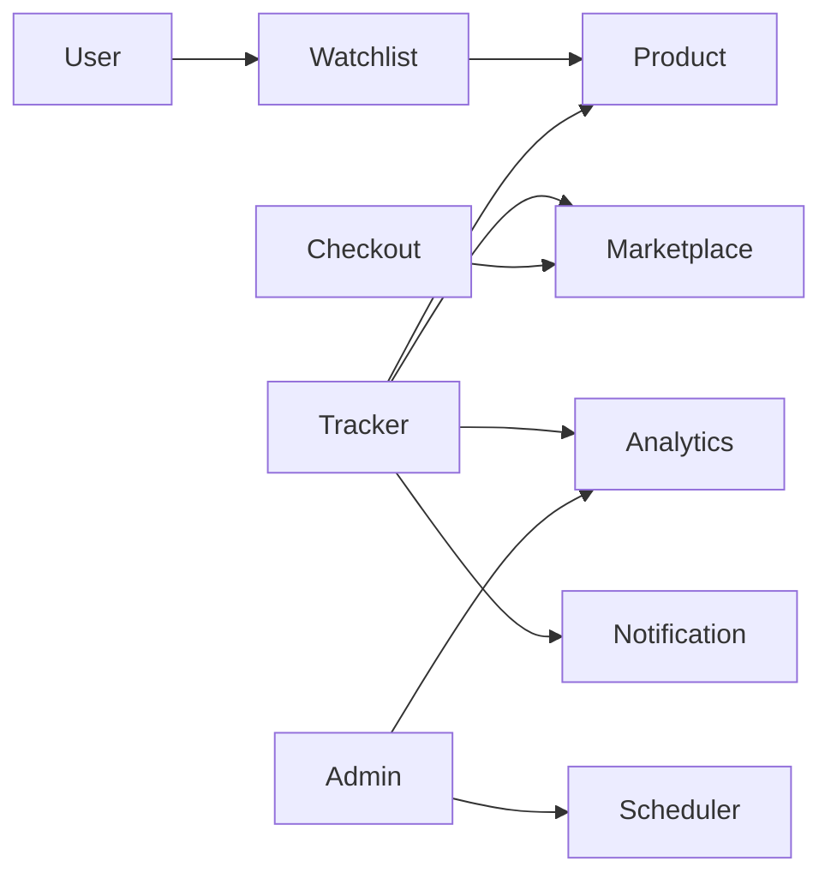
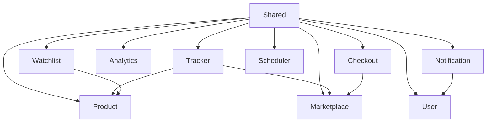

# Modules

> This document defines the domain boundaries of **Prizen**. Every business capability belongs to exactly one module. Modules own their data, business logic, and public interfaces.

---

# Purpose

The goal of modularization is to:

- Enforce clear ownership
- Reduce coupling
- Increase cohesion
- Improve maintainability
- Enable future service extraction

A module should be understandable, testable, and deployable independently.

---

# Module Principles

Every module:

- Owns its database tables
- Owns its business logic
- Owns its public interfaces
- Produces domain events
- Consumes domain events
- Does **not** access another module's persistence layer directly

Communication occurs through exported interfaces.

---

# Module Overview



---

# Shared Kernel

The Shared Kernel contains reusable infrastructure and cross-cutting concerns.

It **must not** contain business logic.

Examples:

- Configuration
- Logging
- Error handling
- Authentication helpers
- Shared value objects
- Common utilities
- Domain event contracts

Every module may depend on the Shared Kernel.

The Shared Kernel may not depend on any module.

---

# Product Module

## Responsibility

Manage products tracked by Prizen.

## Owns

- Product metadata
- Product identifiers
- Product images
- Product lifecycle

## Public API

- Create Product
- Get Product
- Update Product
- Archive Product

## Events Produced

- ProductCreated
- ProductUpdated
- ProductArchived

## Events Consumed

None

## Database Tables

- products
- product_images

## Dependencies

Depends on:

- Marketplace Module

---

# Marketplace Module

## Responsibility

Provide a unified interface for all supported marketplaces.

Marketplace-specific implementations belong here.

## Supported

- Amazon India and Amazon US through bounded HTML retrieval by default
- Optional Amazon Creators API for eligible installation owners
- Flipkart India through the official, owner-configured Affiliate Product API

Future:

- Croma
- Reliance Digital
- Myntra
- eBay
- Walmart
- Best Buy

## Public API

- Validate URL
- Extract Marketplace
- Fetch Product
- Fetch Price
- Fetch Availability

## Events Produced

- MarketplaceRequestFailed

## Database Tables

- marketplaces

## Future Extraction

Marketplace Service

---

# Watchlist Module

## Responsibility

Manage products tracked by users.

## Owns

- Watchlists
- Tracking preferences
- Target prices
- Notification preferences

## Public API

- Create Watchlist
- Remove Watchlist
- Pause Tracking
- Resume Tracking

## Events Produced

- WatchlistCreated
- WatchlistDeleted
- TargetPriceUpdated

## Database Tables

- watchlists

---

# Tracker Module

## Responsibility

Monitor marketplace prices.

This module contains the core business logic of Prizen.

## Responsibilities

- Schedule tracking
- Fetch prices
- Store history
- Detect changes
- Calculate discounts

## Public API

- Track Product
- Refresh Product
- Get Latest Price

## Events Produced

- PriceUpdated
- LowestPriceDetected
- PriceDropped
- ProductUnavailable

## Events Consumed

- WatchlistCreated
- ProductCreated

## Database Tables

- price_history
- latest_prices

---

# Analytics Module

## Responsibility

Generate statistics and insights.

## Responsibilities

- Historical trends
- Lowest price
- Highest price
- Average price
- Discount history
- Price volatility

## Public API

- Price History
- Trend Analysis
- Statistics

## Database Tables

No ownership.

Uses read models generated by Tracker.

Future optimization may introduce analytics tables.

---

# Notification Module

## Responsibility

Deliver notifications through supported channels.

## Providers

- Discord
- Telegram

Future:

- Email
- Push Notifications
- Slack
- SMS

## Public API

- Verify Provider
- Send Notification
- Retry Notification

## Events Produced

- NotificationSent
- NotificationFailed

## Events Consumed

- LowestPriceDetected
- PriceDropped

## Database Tables

- notification_channels
- notification_logs

---

# Scheduler Module

## Responsibility

Manage recurring background jobs.

## Responsibilities

- Schedule scans
- Retry failed scans
- Trigger notifications
- Cleanup expired jobs

## Public API

Internal only.

## Events Produced

- ScanStarted
- ScanCompleted
- ScanFailed

## Database Tables

None

Redis may be used for scheduling state.

---

# User Module

## Responsibility

Manage user accounts.

Initially optional.

Future responsibilities include:

- Authentication
- Profiles
- Preferences
- Billing
- Connected accounts

## Database Tables

- users
- user_settings

Future:

- subscriptions
- billing_accounts

---

# Checkout Module

Status

Future

## Responsibility

Purchase products automatically with explicit user authorization.

Capabilities:

- Store purchase preferences
- Checkout session
- Payment integration
- Marketplace login integration
- Purchase automation

This module should never expose payment details to other modules.

---

# Admin Module

Status

Future

## Responsibilities

- Dashboard
- Monitoring
- Feature flags
- Marketplace health
- Scheduler status
- Job retries

---

# AI Development Module

Status

Development Infrastructure

This is **not** part of the runtime application.

Responsibilities include:

- Generate documentation
- Maintain GitHub issues
- Create milestones
- Open discussions
- Update architecture diagrams
- Validate documentation consistency

See:

docs/10-ai-development.md

---

# Module Dependency Rules



Rules:

- Modules may depend on Shared.
- Shared depends on nothing.
- Circular dependencies are forbidden.
- Infrastructure should be injected through interfaces.

---

# Extraction Strategy

When scaling requires decomposition, modules should be extracted in the following order:

1. Scheduler
2. Tracker
3. Notification
4. Marketplace
5. Analytics
6. Checkout

Extraction should not require changes to domain logic.

---

# Folder Structure

```text
src/

modules/

product/

marketplace/

watchlist/

tracker/

notification/

analytics/

scheduler/

user/

checkout/

shared/
```

Each module contains:

```text
api/
application/
domain/
repository/
infrastructure/
events/
dto/
validators/
tests/
```

---

# Module Checklist

Every new module must answer the following questions:

- What problem does it solve?
- What data does it own?
- What APIs does it expose?
- What events does it publish?
- What events does it consume?
- Which modules may depend on it?
- Can it be extracted independently?

If any answer is unclear, the module design should be revisited before implementation.

---

# Related Documents

- 01-vision.md
- 02-architecture.md
- 04-database.md
- 05-business-logic.md
