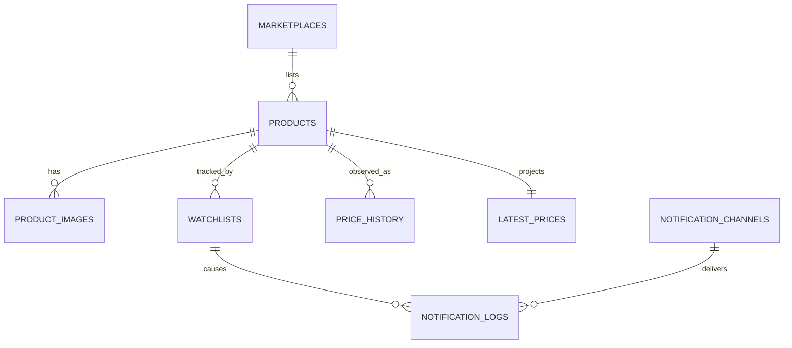

# Database Design

PostgreSQL is Prizen's system of record. The schema mirrors module ownership: tables are shared physically but only their owning module may write them directly.

## Conventions

- UUID primary keys avoid exposing sequential identifiers.
- Timestamps use `timestamptz` and are always recorded in UTC.
- Monetary values use `numeric(12,2)`; floating-point prices are forbidden.
- Prices are immutable observations. `latest_prices` is a replaceable read projection.
- A notification secret is a provider reference, never raw webhook URLs or bot tokens.

## Ownership

| Module       | Tables                                       | Notes                                         |
| ------------ | -------------------------------------------- | --------------------------------------------- |
| Marketplace  | `marketplaces`, `marketplace_configurations` | Provider configuration and encrypted access   |
| Product      | `products`, `product_images`                 | Canonical marketplace product metadata        |
| Watchlist    | `watchlists`                                 | Per-user target and pause preference          |
| Tracker      | `price_history`, `latest_prices`             | Immutable observations and current projection |
| Notification | `notification_channels`, `notification_logs` | Delivery configuration and audit trail        |

## Relationships



## Data lifecycle

Archiving a product prevents new scans but preserves its history. Deleting a product is deliberately not exposed in the API; a future retention worker may remove data only under an explicit account-deletion policy. Product image, watchlist, history, and latest-price rows cascade only for an administrative hard delete.

## Query patterns and indexes

`price_history(product_id, observed_at)` supports chart ranges and latest observation lookup. `products(marketplace_id, external_id)` supports idempotent imports. `watchlists(user_id)` and `watchlists(product_id)` support dashboard and scan scheduling queries. `notification_logs(channel_id, attempted_at)` supports delivery audits.

## Migrations

Use `bun run db:generate` after a schema change, review the generated SQL, then apply it locally
with `bun run db:migrate`. A production migration must be backward compatible with the currently
deployed application.

Released stacks run the reviewed migrations through a one-shot `migrate` service before the app
and tracker start. `db:push` is allowed only for disposable local schema experimentation. Never
use it for a release, an upgrade, a shared database, or any data that must be preserved.

## Upgrade order

1. Back up the database before changing the image version.
2. Update `PRIZEN_IMAGE` or the Compose artifact to the intended release.
3. Run `docker compose up --detach --wait`. Compose starts `init`, waits for PostgreSQL, runs the
   one-shot `migrate` service, and starts the app and tracker only after migration succeeds.
4. Check `docker compose ps` and `docker compose logs migrate` before removing the backup.

Do not start the new app while an older migration is still running. Migrations must use additive,
backward-compatible changes during rollout. Removing or renaming a column requires a later release,
after every deployed application version has stopped using it.

## Failed migration recovery

Create a PostgreSQL backup before every upgrade:

```sh
docker compose exec -T db pg_dump -U prizen -d prizen -Fc > prizen-before-upgrade.dump
```

If migration fails, leave the app and tracker stopped and inspect `docker compose logs migrate`.
Fix transient causes such as storage or connectivity, then rerun `docker compose up --detach
--wait`; Drizzle records completed migrations and resumes with the first unapplied migration.

If the migration made an unsafe partial change, stop the stack and restore the backup rather than
using `db:push` or manually editing Drizzle's journal:

```sh
docker compose stop app tracker migrate
docker compose exec -T db dropdb -U prizen --maintenance-db=postgres --if-exists prizen
docker compose exec -T db createdb -U prizen prizen
docker compose exec -T db pg_restore -U prizen -d prizen --clean --if-exists < prizen-before-upgrade.dump
docker compose up --detach --wait
```

Keep the backup until the upgraded app and tracker are healthy and core data has been verified.
