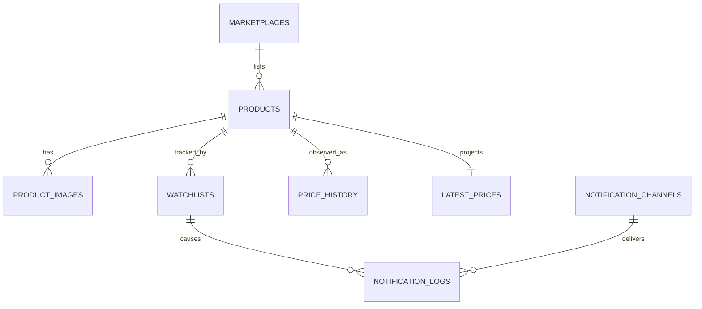

# Database Design

PostgreSQL is Prizen's system of record. The schema mirrors module ownership: tables are shared physically but only their owning module may write them directly.

## Conventions

- UUID primary keys avoid exposing sequential identifiers.
- Timestamps use `timestamptz` and are always recorded in UTC.
- Monetary values use `numeric(12,2)`; floating-point prices are forbidden.
- Prices are immutable observations. `latest_prices` is a replaceable read projection.
- A notification secret is a provider reference, never raw webhook URLs or bot tokens.

## Ownership

| Module       | Tables                                       | Notes                                         |
| ------------ | -------------------------------------------- | --------------------------------------------- |
| Marketplace  | `marketplaces`                               | Provider configuration and availability       |
| Product      | `products`, `product_images`                 | Canonical marketplace product metadata        |
| Watchlist    | `watchlists`                                 | Per-user target and pause preference          |
| Tracker      | `price_history`, `latest_prices`             | Immutable observations and current projection |
| Notification | `notification_channels`, `notification_logs` | Delivery configuration and audit trail        |

## Relationships

## Data lifecycle

Archiving a product prevents new scans but preserves its history. Deleting a product is deliberately not exposed in the API; a future retention worker may remove data only under an explicit account-deletion policy. Product image, watchlist, history, and latest-price rows cascade only for an administrative hard delete.

## Query patterns and indexes

`price_history(product_id, observed_at)` supports chart ranges and latest observation lookup. `products(marketplace_id, external_id)` supports idempotent imports. `watchlists(user_id)` and `watchlists(product_id)` support dashboard and scan scheduling queries. `notification_logs(channel_id, attempted_at)` supports delivery audits.

## Migrations

Use `bun run db:generate` after a schema change, review the generated SQL, then apply it with `bun run db:migrate`. Do not use `db:push` outside local development. A production migration must be backward compatible with the currently deployed application.
