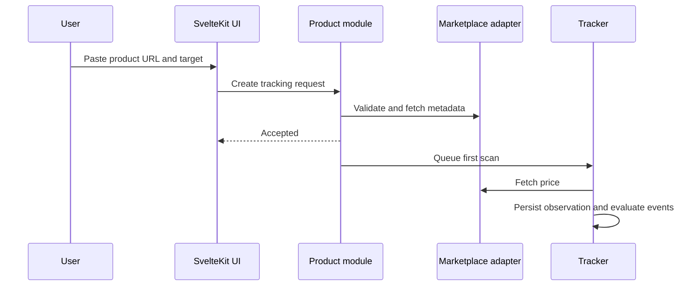

# Workflows

## Track a product

## Alert a user

The tracker detects a qualifying event, creates a deduplication key, and hands a sanitized alert to every verified channel. Each delivery gets an audit log. Retries occur independently per provider.

## Pause and resume

Pausing a watchlist item excludes it from user-driven tracking schedules and alerts without deleting price history. Resuming queues a scan and retains the target price.
