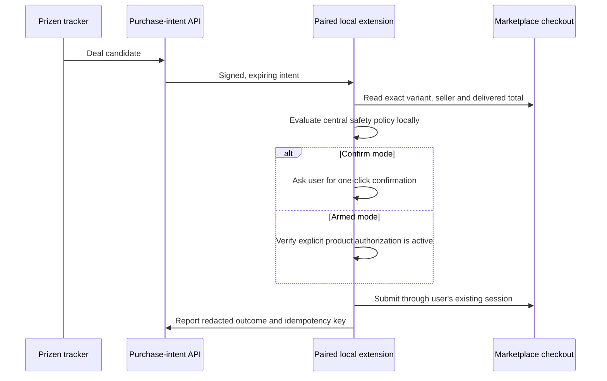

# Purchase Assist

Prizen's consumer purchase flow is marketplace-neutral. The server detects a
deal and issues a short-lived purchase intent; a paired browser extension
revalidates the checkout inside the user's existing marketplace session.
Prizen never receives marketplace passwords, session cookies, card details, or
CVVs.

## Trust boundary

## Adapter capabilities

Every marketplace declares support independently:

- `product_tracking`: product and price observations
- `cart_handoff`: a supported URL or cart preparation flow
- `assisted_checkout`: local extension support for final revalidation

Tracking support never implies checkout support. Unsupported marketplaces keep
the normal Visit Product flow.

## Required safeguards

- Exact marketplace product, variant, seller, fulfilment, and quantity checks
- Maximum delivered total including delivery and tax
- Short authorization expiry and one-time idempotency key
- Confirm mode by default; armed mode must be enabled per product
- Daily purchase limit, cooldown, audit log, and global kill switch
- No payment or marketplace-session secrets in Prizen storage

## Delivery order

1. Pair a browser extension using a revocable device credential.
2. Deliver signed intents over an authenticated event channel.
3. Ship confirm-mode handoff and redacted outcome reporting.
4. Add marketplace adapters independently.
5. Consider armed mode only after policy and reliability review.
